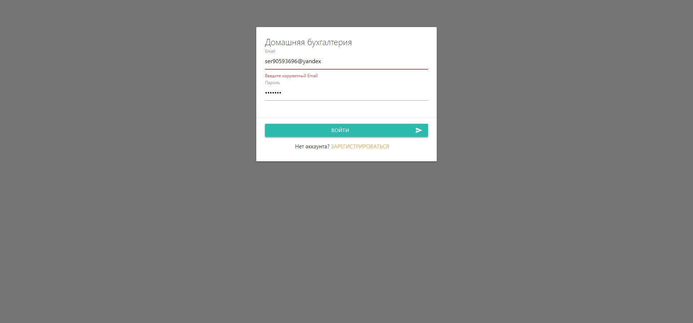
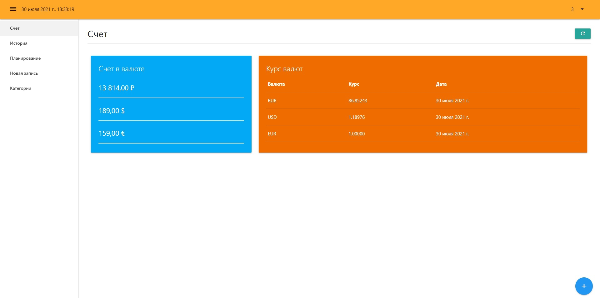
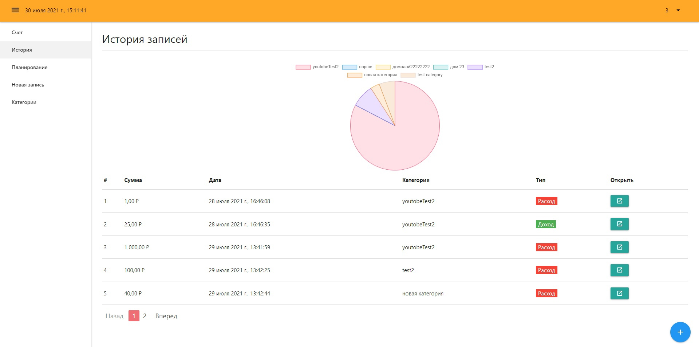
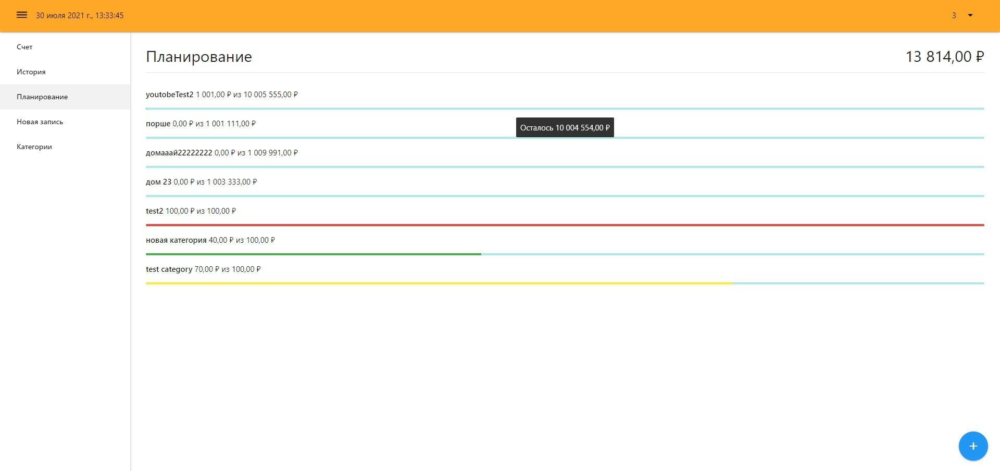
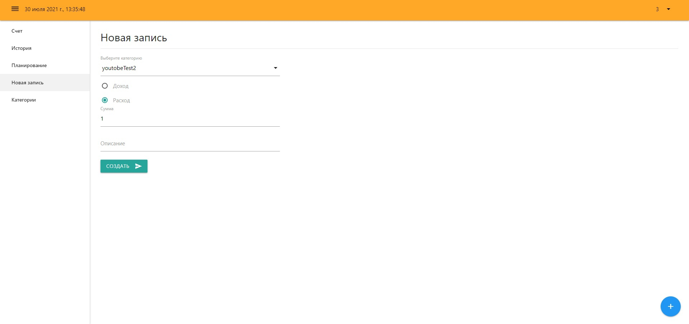
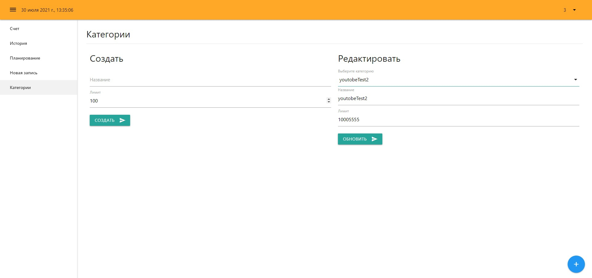
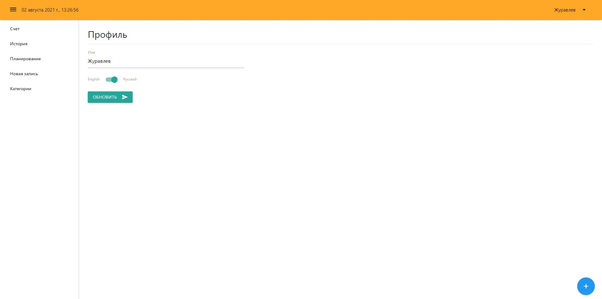

# CRM system 

```
Описание приложения.
```

```
Стек.
JavaScript, Vue - 2, Firebase (database, auth), API Fixer (Валюты), Vue chart.js
```
<!-- 1 -->
```
Страница авторизации/регистрации, валидация
```




<!-- 2 -->
```
Страница баланса денег у данного пользователя и корректные данные по валютам (RUB, USD, EUR)
```



<!-- 3 -->
```
Страница история записей. Показывает расходы/доходы пользователя, можно посмотреть подробней. Пагинация.
```



<!-- 4 -->
```
Страница планирования. Показываем актуальный баланс, показываем прогресс расходов и доходов.
```



<!-- 5 -->
```
Страница новая запись. Можно создать новую категорию дохода/расхода, указать сумму и описание.
```




<!-- 6 -->
```
Страница категории. Можно создать категорию и указать баланс, сколько будет лежать финансов.
Есть возможность подкорректировать указанную категорию и баланс.
```



<!-- 7 -->
```
Страница профиль. Смена имени и radio кнопка для смены языка ru/en.
```

<!-- не сделал еще -->



## Установка зависимостей
```
npm install
```

### Запуск проекта dev
```
npm run serve
```

### Сборка проекта для prod
```
npm run build
```

<!-- https://fixer.io/quickstart  - для валюты АПИ до 1 000 запросов в месяц -->
<!-- дают ключ при регистрации -->

